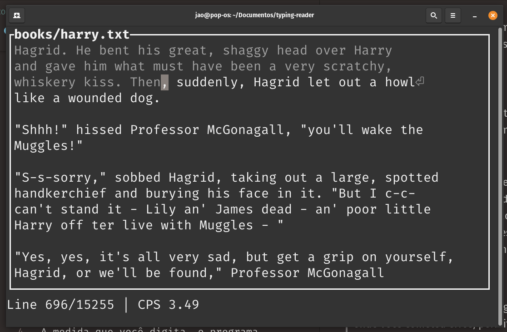

# Typing Reader

This is a typing trainer program, but also a book reader. I decided
to make this because I wanted to get faster at typing, but also read
a book at the same time, so here is it. It's simple and light weight,
just run the program with the name of the file you want to read as
the first argument in the terminal. 

As you type, the program will show you where you made mistakes, allowing
you to backspace your failures before continuing. You will see your current
characters/second in the bottom of the terminal as well, a moving average
of the last 5 lines typed.

## Next steps:
* Overhaul doc-strings
* Add some example books to the repository (considering a new .txt compilation of HPMOR)

## Para Brasileiros

Este é um programa de treino de digitação, mas também um leitor de livros.
Eu decidi fazer isso porque queria treinar a digitação, mas também queria 
ler um livro, então aqui está. É simples e leve, apenas execute o programa
com o nome do arquivo que você deseja ler no primeiro argumento no terminal.

A medida que você digita, o programa irá mostrar onde você cometeu erros,
permitindo que você retroceda seus erros antes de continuar. Você
verá sua velocidade atual de caracteres/segundo no  do terminal,
uma média móvel das últimas 5 linhas digitadas.
