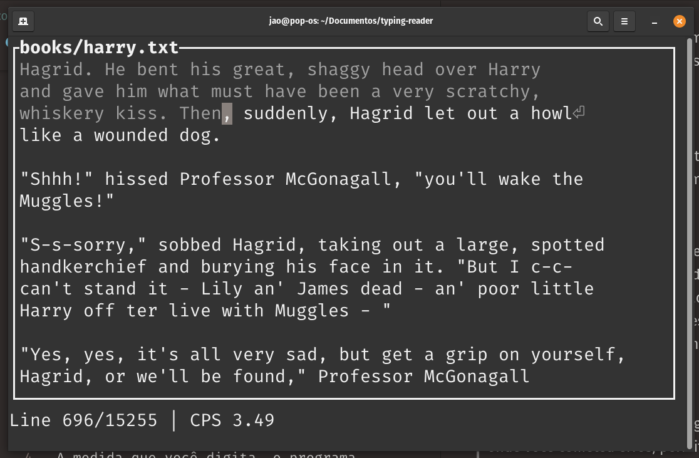

# Typing Reader

Este é um programa de treinamento para digitação, mas também um leitor de livros. Decidi fazer isso porque queria ser mais rápido na digitação, mas também ler um livro ao mesmo tempo, então aqui está. É simples e leve, apenas execute o programa com o nome do arquivo que você deseja ler como primeiro argumento no terminal.

As vezes você erra ao digitar, o programa mostra onde você errou, permitindo que você retroceda seus erros antes de continuar. Você verá sua velocidade atual no final da tela, bem como uma média móvel dos últimos 5 linhas digitadas.



## Próximos passos:
* Melhorar doc-strings
* Adicionar alguns exemplos de livros ao repositório (considerando uma nova compilação em .txt do HPMOR)

## Instalação

```bash
cargo install typing-reader
```
Ou baixe a versão mais recente do [GitHub](https://github.com/JaoCR/typing-reader/releases) para seu sistema operacional. É apenas um único binário.

## Uso

```bash
typing-reader path/to/file.txt
```
e comece a digitar.

Seu texto não deve conter caracteres estranhos, como emojis, traços longos, aspas especiais (aquelas que tem formato diferente à esquerda e à direita), etc. Você deve ser capaz de digitar o texto com o seu próprio teclado.

